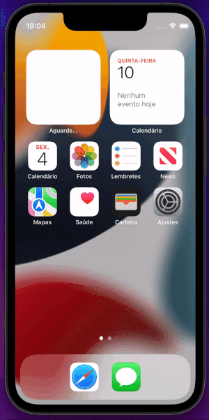

# Splash Screen whit lottie

This project contains a splash screen using a lottie animation file.
----------------------------------------------------------------
Este projeto contém um splash screen utilizando um arquivo de animação do lottie. 

## Getting Started


Clone the repository and run the following commands:
----------------------------------------------------------------
Clone o repositório e execute os seguintes comandos:
```
flutter pub get
flutter run
```

## Screenshots

### Glassmorphism Component


A few resources to get you started if this is your first Flutter project:
----------------------------------------------------------------
Alguns recursos para você começar se este for seu primeiro projeto Flutter:

- [Lab: Write your first Flutter app](https://docs.flutter.dev/get-started/codelab)
- [Cookbook: Useful Flutter samples](https://docs.flutter.dev/cookbook)

For help getting started with Flutter development, view the
[online documentation](https://docs.flutter.dev/), which offers tutorials,
samples, guidance on mobile development, and a full API reference.
